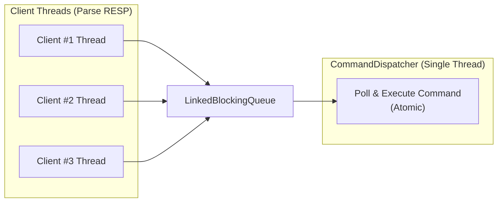

# mini-redis

> A small Redis-inspired server implemented in Java — built to learn, not to replace Redis 🚀

[]

mini-redis is a compact Redis-compatible server written in Java. It started as a personal project to explore Redis internals and to get hands-on practice with Java systems programming. The goal is clarity and correctness for core commands; production-grade features are out of scope for now.

Quick summary
- Purpose: Implementing Redis in Java as a learning and exploration project
- Stability: Stable for the implemented commands listed below
- Maturity: Work-in-progress — more commands and features are planned

Implemented commands
The commands currently implemented in src/commands (as of the latest commit) include:

- String commands
  - GET, SET, MSET, APPEND, INCR, INCRBY, DECR, DECRBY, STRLEN
- Key commands
  - DEL, EXPIRE, TTL, EXISTS
- List commands
  - LPUSH, RPUSH, LRANGE, LLEN, LINDEX, LPOP, RPOP, LSET

Architecture overview
mini-redis is split into clear modules so each responsibility is easy to inspect and extend.

Threading & execution model
- Per-client threads handle network I/O and parse the incoming RESP data stream. Each client connection runs on its own thread and turns RESP arrays into Command objects.
- A single dispatcher thread (the Actor module) serializes command execution: client threads enqueue WorkItem objects into a shared LinkedBlockingQueue; the dispatcher polls one WorkItem at a time and executes the contained Command against the DataStore.

This model keeps parsing and I/O concurrent while ensuring command execution is atomic and sequential.

Simple diagram

Core components
- Network / I/O
  - Thread-per-client blocking I/O handlers that read RESP from sockets and enqueue work.
- Command parser
  - RESP2 parser + CommandParser that builds Command objects from RESP arrays.
- Actor / CommandDispatcher
  - A Runnable that consumes a single LinkedBlockingQueue<WorkItem> and executes commands against the DataStore.
- Storage
  - In-memory DataStore storing typed values (StringValue, ListValue, HashValue, SetValue) wrapped in Entry objects (with optional expiration timestamps).

Design notes
- The Actor-style CommandDispatcher simplifies concurrency by serializing command execution; this minimizes the need for fine-grained locking in the DataStore and makes correctness easier to reason about.
- Code is organized so parsing, storage, and networking are separated — this keeps the implementation approachable and makes it simpler to add new commands or swap components (for example, to add persistence later).
- Correctness for core commands is prioritized over premature optimization.

Requirements
- Java 17+

Contributing
- Pull requests and issues are welcome. Contributions that improve correctness, tests, or documentation are appreciated.

License
- Add your preferred license (e.g., MIT) to the repository.

Notes
- This project was created to learn Redis internals and Java server programming. It is not a production Redis replacement and remains a work-in-progress.
