# RedJ

> A Redis-inspired server implemented in **Java 17** — built to **learn internals**, not to replace Redis 🚀

<p align="center">
  
  
  
</p>

---

## Overview

**RedJ** is a compact, Redis-compatible server written in Java.
It is designed as a **learning project** to explore:

* Redis internals and execution semantics
* RESP protocol parsing
* Transaction handling (`MULTI` / `EXEC`)
* Concurrency and command execution models
* Java systems programming

The emphasis is on **clarity, correctness, and architecture**, not production completeness.

> This project is **not** a production Redis replacement.

---

## Build

build the .jar file

```bash
  cd Redj
  ./build.sh
```
and run it using

```bash
  java -jar RedJ.jar
```


## Client Compatibility

RedJ speaks the **RESP2 protocol** and is therefore **compatible with standard Redis clients**, including:

* `redis-cli`
* Redis client libraries for Java, JavaScript, Python, etc.

From a client’s perspective, RedJ behaves like a Redis server for all implemented commands and features.

---

## Project Goals

* ✅ Understand Redis command execution semantics
* ✅ Implement core Redis data types and commands
* ✅ Support Redis-style transactions
* ✅ Explore concurrency models (Actor-style execution)
* ❌ Persistence, clustering, and replication (out of scope for now)

---

## Implemented Commands

Commands currently implemented in `src/commands`:

### Key Commands

* `DEL`
* `EXPIRE`
* `TTL`
* `EXISTS`

### String Commands

* `GET`, `SET`, `MSET`
* `APPEND`
* `INCR`, `INCRBY`
* `DECR`, `DECRBY`
* `STRLEN`

### List Commands

* `LPUSH`, `RPUSH`
* `LRANGE`
* `LLEN`
* `LINDEX`
* `LPOP`, `RPOP`
* `LSET`

### Hash Commands

* `HSET`, `HGET`
* `HMGET`, `HGETALL`
* `HDEL`
* `HKEYS`, `HVALS`
* `HLEN`
* `HINCRBY`
* `HEXISTS`

### Set Commands

* `SADD`, `SREM`
* `SCARD`
* `SMEMBERS`

### Transaction Commands

* `MULTI`
* `EXEC`
* `DISCARD`

> 🟢 All listed commands are stable and tested within the current architecture.

---

## Transactions

RedJ supports **Redis-style transactions** using `MULTI` / `EXEC`.

* Commands issued after `MULTI` are **queued**, not executed immediately
* `EXEC` executes all queued commands **atomically** and returns their results as an array
* If a command has a **syntax error**, the transaction is aborted
* Runtime errors are reported per-command, matching Redis behavior

This implementation mirrors Redis’ transactional semantics while remaining simple and inspectable.

---

## Architecture Overview

RedJ is intentionally split into **clear, inspectable modules**, making it easy to extend and reason about.

---

## Threading & Execution Model

The server uses a **hybrid concurrency model**:

### Client Side

* Each client connection runs on its **own thread**
* Responsibilities:

  * Blocking socket I/O
  * RESP parsing
  * Command construction
  * Enqueuing work

### Execution Side

* A **single dispatcher thread** (Actor-style)
* Ensures:

  * Atomic command execution
  * Deterministic behavior
  * Minimal locking in the data store

### Why this model?

> Parsing and I/O remain concurrent, while **all command execution is serialized**, closely matching Redis’ execution guarantees.

---

## Execution Flow (Diagram)

```mermaid
flowchart LR
    subgraph Clients["Client Threads"]
        C1["Client #1"]
        C2["Client #2"]
        C3["Client #3"]
    end

    Q["LinkedBlockingQueue<WorkItem>"]

    subgraph Dispatcher["Command Dispatcher"]
        D["Poll → Execute Command (Atomic)"]
    end

    C1 --> Q
    C2 --> Q
    C3 --> Q
    Q --> D
```


